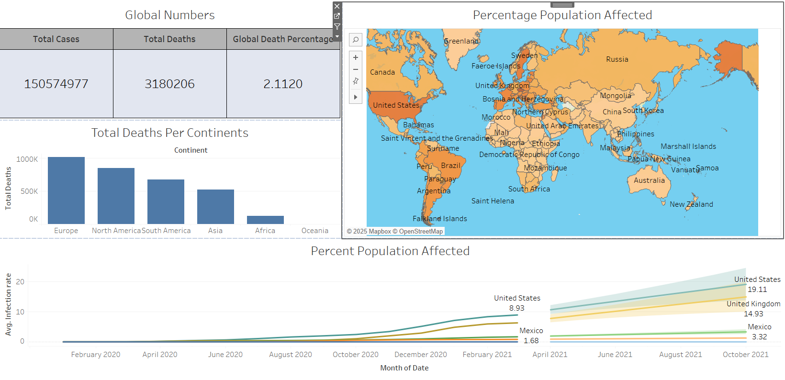

# 🌍 COVID-19 Data Analysis & Dashboard

This project presents an end-to-end data analysis and business intelligence solution that explores the global impact of COVID-19 using real-world datasets. It combines data wrangling with SQL and insightful visualizations using Tableau to support informed decision-making.

---

## 📊 Project Overview

The objective of this project is to extract, analyze, and visualize global COVID-19 trends using data on case numbers, deaths, and vaccinations. The project showcases skills in SQL development, data cleaning, data transformation, and business intelligence visualization.

---

## 🛠️ Tools & Technologies

- **SQL Server** – For data querying and transformation  
- **Microsoft Excel** – Initial data source (`CovidDeaths.xlsx`, `CovidVaccins.xlsx`)  
- **Tableau** – For building an interactive dashboard    
- **GitHub** – Version control and collaboration  

---

## 🧾 Data Sources

- **CovidDeaths.xlsx** – Contains global data on confirmed cases and deaths  
- **CovidVaccins.xlsx** – Contains country-level vaccination data  

Data is adapted from public datasets provided by [Our World In Data](https://ourworldindata.org/coronavirus).

---

---

## 📸 Dashboard Preview

> Built using Tableau – Includes filters for countries, KPIs, and dynamic visualizations.

You can explore the `.twbx` file locally using Tableau Desktop or Tableau Public.

